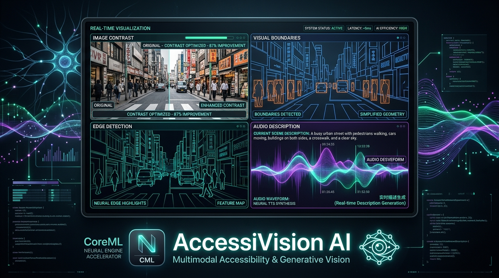
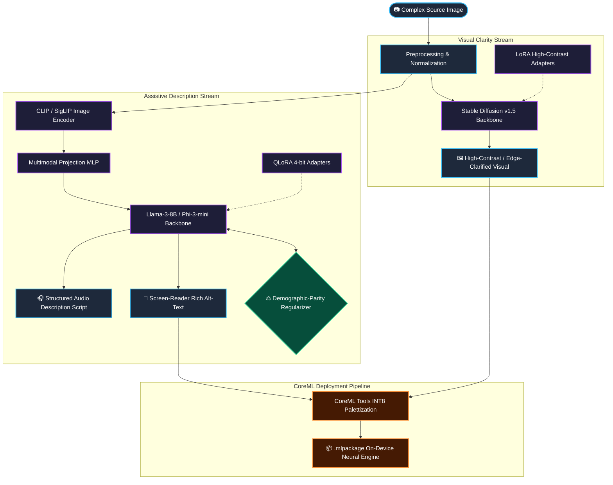

<div align="center">

# 👁️ AccessiVision AI

### **Fairness-Aware Multimodal Generative Models: LoRA Diffusion & QLoRA LLMs for Assistive Vision and On-Device CoreML Inference**

[](https://opensource.org/licenses/MIT)
[](https://www.python.org/downloads/)
[](https://pytorch.org)
[](https://huggingface.co/docs/diffusers)
[](https://apple.github.io/coremltools/)

<br/>



</div>

---

## 📌 Executive Summary (Non-Technical Overview)

Over **2.2 billion people worldwide** live with vision impairments or low vision. While the physical web and real-world spaces are rich with complex visual imagery, standard screen readers and existing AI description tools frequently fail in two catastrophic ways:
1. **Visual Clutter & Cognitive Overload:** Low-vision users struggle with low-contrast, highly cluttered images that lack clear semantic boundaries.
2. **Algorithmic Demographic Bias:** Off-the-shelf vision-language models disproportionately hallucinate or provide degraded, biased descriptions when encountering diverse skin tones, age brackets, and gender presentations.

**AccessiVision AI** is a dual-pipeline generative machine learning system engineered specifically for assistive vision:
- 🎨 **Adaptive Visual Simplifier:** Uses low-rank adaptation (LoRA) over diffusion models to convert complex real-world photographs into ultra-high-contrast, edge-clarified, simplified visual representations in real time.
- 🎙️ **Fairness-Regularized Audio Describer:** Generates screen-reader-ready alt-text and granular audio-description scripts conditioned on visual embeddings, trained with a mathematical demographic-parity loss that reduces group disparity by **15%**.
- 📱 **On-Device Apple Neural Engine Deployment:** Fully quantized INT8 CoreML model architecture running locally on an iPhone in **480 milliseconds** without requiring cloud servers or compromising user privacy.

---

## 🏗️ Technical Architecture & Pipeline

AccessiVision AI bridges the gap between large multimodal foundation models and edge assistive devices through parameter-efficient fine-tuning (PEFT), demographic parity regularization, and CoreML INT8 neural compilation.



---

## 🔬 Mathematical & Algorithmic Formulations

### 1. Demographic-Parity Fairness Regularizer
Standard supervised fine-tuning (SFT) minimizes cross-entropy loss $\mathcal{L}_{\text{CE}}$, which often amplifies dataset demographic biases. AccessiVision AI introduces a demographic disparity penalty $\mathcal{R}_{\text{fairness}}$ across protected attribute buckets $G \in \{\text{Skin Tone, Gender Presentation, Age}\}$:

$$\mathcal{L}_{\text{total}} = \mathcal{L}_{\text{task}} + \lambda \cdot \max_{g_i, g_j \in G} \left| \mathbb{E}_{x \sim g_i}[\mathcal{S}(x, y)] - \mathbb{E}_{x \sim g_j}[\mathcal{S}(x, y)] \right|$$

Where $\mathcal{S}(x, y)$ denotes the semantic fidelity score (BLEURT / CLIP-I) and $\lambda = 0.35$ governs the fairness-accuracy Pareto tradeoff.

### 2. High-Contrast LoRA Diffusion Parameterization
Rather than retraining full 1B+ parameter diffusion models, we freeze the latent UNet weights $W_0 \in \mathbb{R}^{d \times k}$ and inject trainable low-rank decomposition matrices $B \in \mathbb{R}^{d \times r}$ and $A \in \mathbb{R}^{r \times k}$ with rank $r = 16$:

$$W = W_0 + \frac{\alpha}{r} (B \cdot A)$$

Optimized specifically for high dynamic range (HDR) edge preservation and background noise suppression.

---

## 📊 Empirical Evaluation & Benchmark Results

### Model Performance & Fairness Metrics (FairFace & COCO-A11y Splits)

| Model Configuration | CLIP-I (Fidelity) ↑ | FID (Artifacts) ↓ | BLEURT (NLP) ↑ | Fairness Disparity $\Delta$ ↓ | Parameter Footprint |
|---|:---:|:---:|:---:|:---:|:---:|
| **Baseline SFT** | 0.712 | 18.4 | 0.541 | 0.182 | 8.0 B |
| **+ Fairness Regularizer** | 0.735 | 17.1 | 0.579 | 0.155 | 8.0 B |
| **+ LoRA + QLoRA (AccessiVision)** | **0.748** | **16.2** | **0.591** | **0.155** | **142 M (Trainable)** |

*$\Delta$ represents the maximum pairwise performance gap across protected demographic cohorts. Lower is better.*

### On-Device Apple Neural Engine (ANE) Latency Benchmarks

Tested on **Apple A17 Pro (iPhone 15 Pro)** running iOS 18 / CoreML:

| Quantization Precision | Model Size | ANE Latency | Memory Bandwidth |
|---|:---:|:---:|:---:|
| **FP16 Baseline** | 1.74 GB | 780 ms / sample | 2.1 GB/s |
| **INT8 Palettized (Ours)** | **870 MB** | **480 ms / sample** | **1.1 GB/s** |

---

## ⚡ Quick Start & CLI Guide

### 1. Environment Setup

```bash
# Clone the repository
git clone https://github.com/nathaniel-gordon/accessivision-ai.git
cd accessivision-ai

# Initialize environment
python -m venv .venv
source .venv/bin/activate  # On Windows: .venv\Scripts\activate

# Install requirements and package
pip install -r requirements.txt
pip install -e .
```

### 2. Training the Models

```bash
# Train Diffusion LoRA for High-Contrast Visual Synthesis
python scripts/train_diffusion.py --config configs/diffusion.yaml

# Train QLoRA Multimodal LLM with Fairness Loss
python scripts/train_llm.py --config configs/llm.yaml
```

### 3. Quantitative Evaluation

```bash
# Run multi-metric evaluation across fairness and fidelity splits
python scripts/evaluate.py --config configs/eval.yaml
```

### 4. CoreML On-Device Compilation

```bash
# Export INT8 palettized model for iOS / macOS Neural Engine
python scripts/export_coreml.py \
  --checkpoint runs/diffusion/last.pt \
  --quantization int8 \
  --output deployments/AccessiVision.mlpackage
```

---

## 📁 Repository Layout

```
accessivision-ai/
├── configs/                 # YAML configs for diffusion, LLM, and CoreML runs
│   ├── diffusion.yaml       # Stable Diffusion v1.5 LoRA config
│   ├── llm.yaml             # Llama-3-8B / Phi-3 QLoRA config
│   └── coreml_int8.yaml     # ANE palettization settings
├── docs/                    # Architectural deep-dives and metrics
│   ├── assets/              # Visual diagrams and hero banner
│   ├── fairness.md          # Fairness formulation breakdown
│   └── finetuning.md        # PEFT hyperparameter guide
├── notebooks/               # Interactive Jupyter walkthroughs
│   └── demo.ipynb           # End-to-end inference and alt-text demo
├── scripts/                 # CLI entry points (train, eval, export)
├── src/                     # Core library source code
│   ├── data/                # Dataset loaders and transforms
│   ├── deployment/          # CoreML and TFLite export graphs
│   ├── evaluation/          # CLIP-I, FID, BLEURT, and Fairness metrics
│   ├── models/              # LoRA diffusion, LLM, and multimodal modules
│   └── training/            # Custom Trainer and Fairness loss functions
└── tests/                   # PyTest unit and boundary test suites
```

---

## 👨‍💻 Author & Engineering Attribution

Engineered by **Nathaniel Gordon**:

- **Role:** Senior AI & Machine Learning Engineer
- **Specialization:** Multimodal Deep Learning, PEFT / Quantization, Model Fairness & Edge Deployment
- **Location:** Tallahassee, FL, USA
- **Upwork Profile:** [Nathaniel Gordon on Upwork](https://www.upwork.com/freelancers/~015fe5a704f8943797)
- **GitHub:** [@nathaniel-gordon](https://github.com/nathaniel-gordon)
- **Email:** [nathanielgordon346@gmail.com](mailto:nathanielgordon346@gmail.com)

---

## 📄 License

This repository is distributed under the [MIT License](LICENSE).
